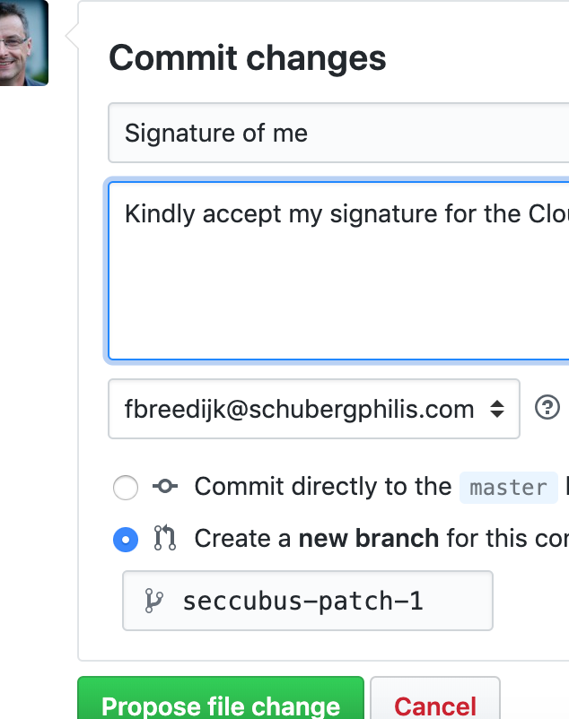

How to sign the manifesto?
===
All "signatures" are stored in our [GitHub repository](https://github.com/seccubus/CloudCraftsmenship/signatures). You can sign the manifesto either as an individual or as part of your organisation.

If you know how to use git...
---
Add your data to `signatures/index.md` and create a pull request.

If you don't know how to use git...
---
* [Create a GitHub account](https://www.wikihow.com/Create-an-Account-on-GitHub) (If you dont have one)
* Sign into GitHub
* [Edit this file](https://github.com/seccubus/CloudCraftsmenship/edit/master/signatures/index.md)
* Add your data to the bottom of the list like this:

```
| Name               | GitHub handle.    | Organisation         | Role      | Date (yyyy-mm-dd) |
|--------------------|-------------------|----------------------|-----------|---------------------|
| C. Craftsman       | @CloudCrafstman   | CloudCraftsman Inc.  | Craftsman | 1984-01-01        |
```
* Make sure you create a new pull request

* Press 'Propose file change'


